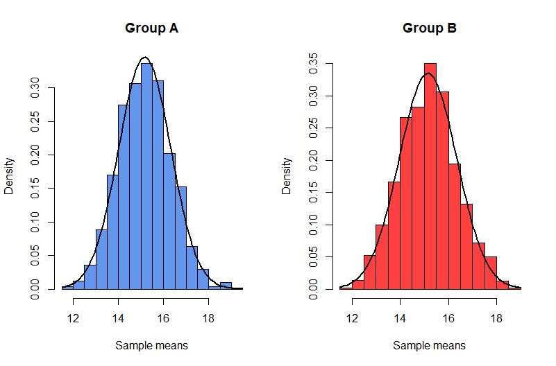
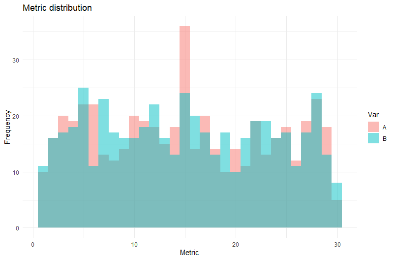
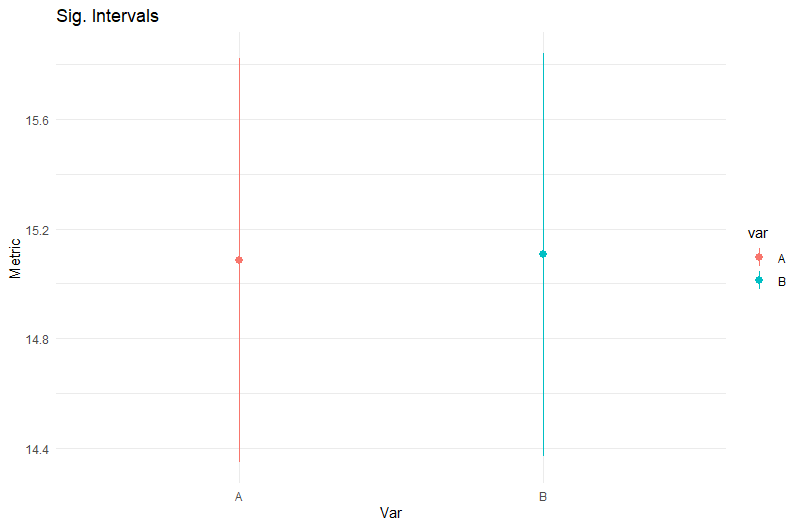

# T-test (Welch, Student)
T-test is the most used statistical test for compare difference in groups.

In this case we will create dirty dataset with outliers and NA's, then we clear it, and do some checks for being sure that T-test is right choise.

We will do check for homogenius disperce with Levene's or Fligner-Killeen's test, normality of sample means distribution with Shapiro-Wilk test:

</img>

Then we will create some plots for visualise our test data. Histogram:

</img>

and sig. intervals:

</img>
